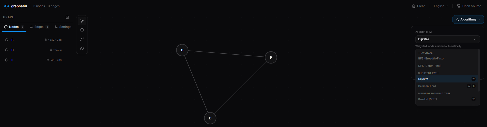

# graphs4u

> Open-source graph algorithm visualizer — create, edit, and run algorithms on graphs interactively.


## Features

- **Interactive Graph Board** — SVG-based canvas with pan, zoom, and grid
- **Node Management** — Click to add nodes, drag to reposition, inline label editing
- **Edge Management** — Click two nodes to connect them, with support for directed and weighted graphs
- **Tools** — Select, Add Node, Add Edge, and Delete tools with keyboard shortcuts
- **Dark Mode** — Minimalist dark UI designed for focus
- **Sidebar** — Manage nodes, edges, and graph settings from a collapsible panel

## Getting Started

```bash
# Install dependencies
npm install

# Start dev server
npm run dev
```

## Keyboard Shortcuts

| Key | Action |
|-----|--------|
| `V` | Select tool |
| `N` | Add Node tool |
| `E` | Add Edge tool |
| `D` | Delete tool |
| `Del` / `Backspace` | Delete selected |
| `Esc` | Clear selection |
| `Shift + Click` | Multi-select |
| `Scroll` | Zoom in/out |

## Tech Stack

- **React 19** with TypeScript (strict mode)
- **Tailwind CSS v4** with CSS custom properties for theming
- **Tailwind Variants** for component variant styling
- **Tailwind Merge** for class merging
- **Lucide React** for icons

## Project Structure

```
src/
├── components/
│   ├── board/           # Graph canvas and toolbar
│   ├── layout/          # App header
│   ├── sidebar/         # Sidebar panel, node/edge lists, settings
│   └── ui/              # Reusable UI primitives
├── stores/              # Graph state (Context + useReducer)
├── types/               # TypeScript type definitions
├── lib/                 # Utility functions
├── App.tsx              # Root layout
└── main.tsx             # Entry point
```

## Contributing

See [CONTRIBUTING.md](CONTRIBUTING.md) for guidelines on how to open issues and submit pull requests.

## License

MIT — see [LICENSE.md](LICENSE.md) for details.
